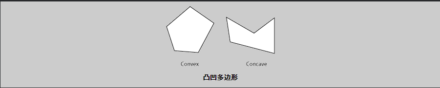
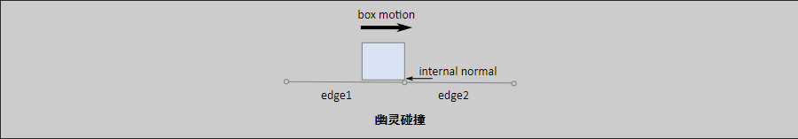
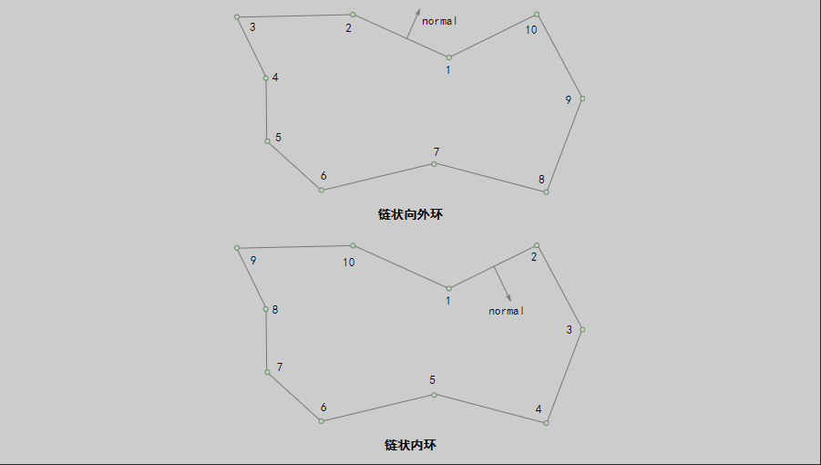
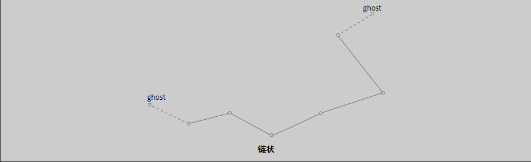
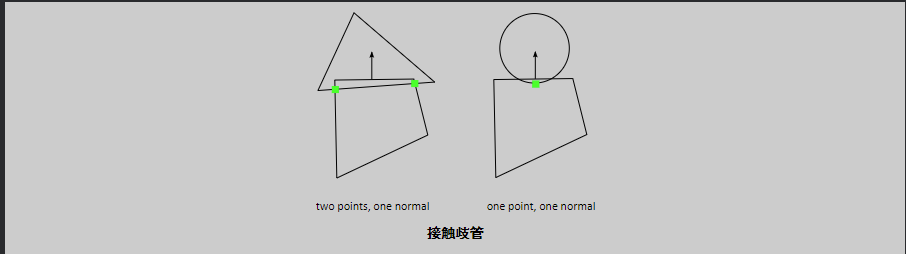
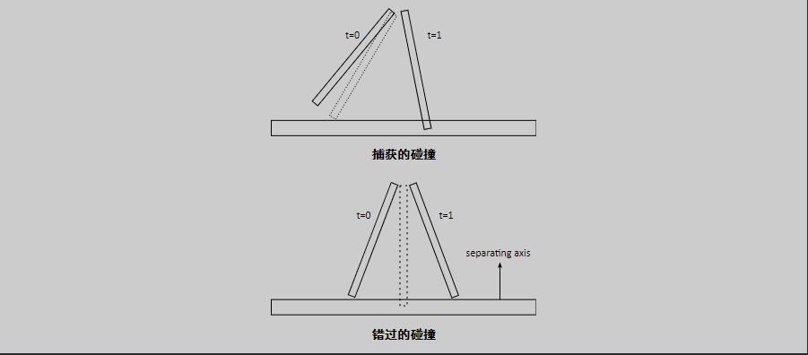
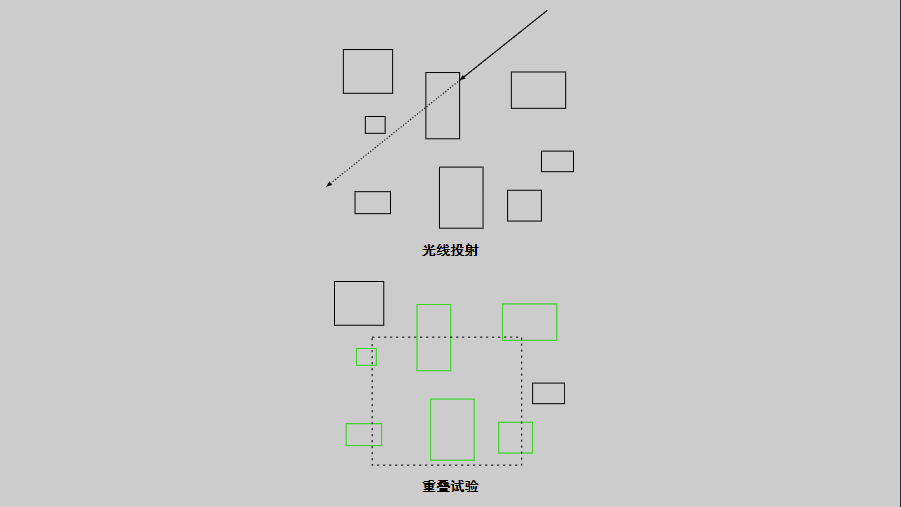

## 碰撞模块

碰撞模块包含操作它们的形状和函数。该模块还包含了一个动态树和大系统加速碰撞处理的宽阶段。

碰撞模块设计为可在动态系统之外使用。例如，除了物理，你可以在游戏的其他方面使用动态树。

然而，Box2D的主要目的是提供一个刚体物理引擎，因此在某些应用中，碰撞模块本身的使用可能会受到限制。同样地，我也不会花很大的力气来记录它或润色api。

# 形状

形状描述了碰撞几何，可以独立于物理模拟使用。至少，您应该了解如何创建以后可以附加到刚体的形状。

Box2D形状实现[B2形状](https://box2d.org/documentation/classb2_shape.html)基类。基类定义函数以：

- 测试与形状重叠的点
- 对形状执行光线投射
- 计算形状的AABB
- 计算形状的质量特性

此外，每个形状都有一个类型成员和一个半径。半径甚至适用于多边形，如下所述。

请记住，形状不了解物体，并且与动力学系统无关。形状以紧凑的形式存储，并针对大小和性能进行了优化。因此，形状不容易移动。必须手动设置形状顶点位置才能移动形状。但是，使用固定装置将形状附着到实体上时，形状会随主体实体刚性移动。总而言之：

- 当一个形状**不**附加到实体后，可以将其顶点视为在世界空间中表示的顶点。
- 将形状附加到实体时，可以将其顶点视为以局部坐标表示。

## 圆形形状

圆形有一个位置和半径。圆圈是实心的。不能使用圆形状制作空心圆。

```c++
b2CircleShape circle;
circle.m_p.Set(2.0f, 3.0f);
circle.m_radius = 0.5f;
```

## 多边形形状

多边形是实凸多边形。当所有连接内部两点的线段不与多边形的任何边相交时，多边形是凸的。多边形是实心的，从不空心。多边形必须有3个或更多顶点。



多边形顶点以逆时针方向缠绕（CCW）方式存储。我们必须小心，因为逆时针方向的概念是关于一个右手坐标系，z轴指向平面之外。这可能在屏幕上是顺时针方向的，这取决于坐标系约定。


多边形成员是公共的，但是应该使用初始化函数来创建多边形。执行初始化和创建法向量的功能。

可以通过传入顶点数组来创建多边形。数组的最大大小由`b2_maxPolygonVertices`默认值为8。这足以描述大多数凸多边形。

这个`b2PolygonShape::Set`函数自动计算凸壳并建立适当的缠绕顺序。当顶点数较少时，此函数速度较快。如果你增加`b2最大多边形顶点`，则凸壳计算可能会变慢。还请注意，凸壳函数可能会消除和/或重新排序您提供的点。比`b2_linearSlop`可以合并

```c++
// This defines a triangle in CCW order.
b2Vec2 vertices[3];
vertices[0].Set(0.0f, 0.0f);
vertices[1].Set(1.0f, 0.0f);
vertices[2].Set(0.0f, 1.0f);
 
int32 count = 3;
b2PolygonShape polygon;
polygon.Set(vertices, count);
```

多边形有一些方便的函数来创建长方体。

```c++
void SetAsBox(float hx, float hy);
void SetAsBox(float hx, float hy, const b2Vec2& center, float angle);
```

多边形继承半径[B2形状](https://box2d.org/documentation/classb2_shape.html). 半径将围绕多边形创建蒙皮。蒙皮用于堆叠场景，以保持多边形稍微分开。这允许连续的碰撞作用于核心多边形。


多边形蒙皮通过保持多边形的分离有助于防止隧道穿越。这将导致形状之间的小间隙。视觉表示可以比多边形大，以隐藏任何间隙。


并不是说多边形蒙皮仅用于帮助连续碰撞。目的不是模拟圆形多边形。

## 边缘形状

边缘形状是线段。这些是为了帮助你的游戏制作一个自由形式的静态环境。边缘形状的一个主要限制是，它们可以与圆和多边形碰撞，但不能与自身碰撞。Box2D使用的碰撞算法要求两个碰撞形状中至少有一个具有体积。边形状没有体积，因此边-边碰撞是不可能的。

```c++
// This an edge shape.
b2Vec2 v1(0.0f, 0.0f);
b2Vec2 v2(1.0f, 0.0f);
 
b2EdgeShape edge;
edge.SetTwoSided(v1, v2);
```

在许多情况下，游戏环境是通过端到端连接多个边缘形状来构建的。当多边形沿边链滑动时，这可能会导致意外的伪影。在下图中，我们看到一个盒子与一个内部顶点相撞。这些*鬼*当多边形与生成内部碰撞法线的内部顶点碰撞时，会导致碰撞。



如果edge1不存在，那么这种碰撞似乎没问题。在edge1存在的情况下，内部碰撞似乎是一个bug。但通常情况下，当Box2D碰撞两个形状时，它会孤立地查看它们。

幸运的是，边缘形状提供了一种机制，通过存储相邻对象来消除重影碰撞*鬼*顶点。Box2D使用这些重影顶点来防止内部碰撞。


用于处理重影碰撞的Box2D算法只支持单侧碰撞。从第一个顶点向第二个顶点看时，前面在右侧。这与多边形使用的逆时针缠绕顺序相匹配。

```c++
// This is an edge shape with ghost vertices.
b2Vec2 v0(1.7f, 0.0f);
b2Vec2 v1(1.0f, 0.25f);
b2Vec2 v2(0.0f, 0.0f);
b2Vec2 v3(-1.7f, 0.4f);
 
b2EdgeShape edge;
edge.SetOneSided(v0, v1, v2, v3);
```

一般来说，用这种方法缝合边有点浪费和乏味。这就引出了链状结构。

## 链形

链状结构提供了一种有效的方法来连接多个边缘，以构建静态游戏世界。自动消除碰撞和单侧碰撞。碰撞是单侧的，以消除重影碰撞。

如果不关心重影碰撞，则可以创建一组双面边形状。效率是相似的。

使用链形状的最简单方法是创建循环。只需提供一个顶点数组。

```c++
b2Vec2 vs[4];
vs[0].Set(1.7f, 0.0f);
vs[1].Set(1.0f, 0.25f);
vs[2].Set(0.0f, 0.0f);
vs[3].Set(-1.7f, 0.4f);
 
b2ChainShape chain;
chain.CreateLoop(vs, 4);
```

边缘法线取决于缠绕顺序。逆时针缠绕顺序使法线朝外，顺时针缠绕顺序使法线向内。



你可能有一个滚动的游戏世界，并想连接几个链在一起。可以使用重影顶点将链连接在一起，就像我们使用的一样[b2EdgeShape公司](https://box2d.org/documentation/classb2_edge_shape.html) .



```c++
b2ChainShape::CreateChain(const b2Vec2* vertices, int32 count,
        const b2Vec2& prevVertex, const b2Vec2& nextVertex);
```

不支持链形状的自相交。它可能有用，也可能不起作用。防止重影碰撞的代码假定链没有自相交。此外，非常接近的顶点也会导致问题。确保所有边缘的长度超过b2_linearSlop（5毫米）。


链中的每条边都被视为子形状，可以通过索引访问。当一个链形连接到一个物体上时，每一条边都会在宽相位碰撞树中得到自己的边界框。

```c++
// Visit each child edge.
for (int32 i = 0; i \< chain.GetChildCount(); ++i)
{
    b2EdgeShape edge;
    chain.GetChildEdge(&edge, i);
 
    ...
}
```

# 几何查询

可以对单个形状执行两个几何查询。

## 形状点测试

可以测试点是否与形状重叠。为形状和世界点提供变换。

```c++
b2Transform transform;
transform.SetIdentity();
b2Vec2 point(5.0f, 2.0f);
 
bool hit = shape->TestPoint(transform, point);
```

边和链形状始终返回false，即使链是循环。

## 形状光线投射

可以在形状上投射光线以获得第一个交点和法向量。因为光线投射一次只检查一条边，所以包含链形状的子索引。

> **注意安全**：如果光线开始于圆形或多边形等凸面形状内，则不会记录命中。这与Box2D将凸面形状视为实体是一致的。

```c++
b2Transfrom transform;
transform.SetIdentity();
 
b2RayCastInput input;
input.p1.Set(0.0f, 0.0f);
input.p2.Set(1.0f, 0.0f);
input.maxFraction = 1.0f;
int32 childIndex = 0;
 
b2RayCastOutput output;
bool hit = shape->RayCast(&output, input, transform, childIndex);
 
if (hit)
{
    b2Vec2 hitPoint = input.p1 + output.fraction * (input.p2 -- input.p1);
    ...
}
```

# 成对函数

碰撞模块包含一对形状并计算一些结果的函数。其中包括：

- 重叠
- 接触歧管
- 距离
- 撞击时间

## 重叠

可以使用此函数测试两个形状是否重叠：

```c++
b2Transform xfA = ..., xfB = ...;
bool overlap = b2TestOverlap(shapeA, indexA, shapeB, indexB, xfA, xfB);
```

同样，对于链形状的情况，必须为提供子索引。

## 接触歧管

Box2D具有计算重叠形状接触点的函数。如果考虑圆或圆多边形，则只能得到一个接触点和法线。在多边形的情况下，我们可以得到两个点。这些点共享相同的法向量，因此Box2D将它们组合成流形结构。接触求解器利用这一点来提高堆叠稳定性。



通常，您不需要直接计算接触流形，但是您可能会使用模拟中产生的结果。

这个[B2歧管](https://box2d.org/documentation/structb2_manifold.html)结构包含一个法向量和最多两个接触点。法线和点保持在局部坐标中。为了方便接触求解器，每个点存储法向和切向（摩擦）脉冲。

存储在[B2歧管](https://box2d.org/documentation/structb2_manifold.html)为内部使用而优化。如果您需要这些数据，通常最好使用[b2世界流形](https://box2d.org/documentation/structb2_world_manifold.html)结构生成接触法线和点的世界坐标。你需要提供一个[B2歧管](https://box2d.org/documentation/structb2_manifold.html)形状的变化和半径

```c++
b2WorldManifold worldManifold;
worldManifold.Initialize(&manifold, transformA, shapeA.m_radius,
transformB, shapeB.m_radius);
 
for (int32 i = 0; i \< manifold.pointCount; ++i)
{
    b2Vec2 point = worldManifold.points[i];
    ...
}
```

请注意，世界流形使用原始流形的点计数。

在模拟过程中，形状可能会移动，流形可能会改变。可以添加或删除点。您可以使用b2GetPointStates检测到这一点。

```c++
b2PointState state1[2], state2[2];
b2GetPointStates(state1, state2, &manifold1, &manifold2);
 
if (state1[0] == b2_removeState)
{
    // process event
}
```

## 距离

这个`b2Distance`函数可用于计算两个形状之间的距离。距离函数需要将两个形状转换为[ b2DistanceProxy](https://box2d.org/documentation/structb2_distance_proxy.html). 还有一些缓存用于对重复调用的距离函数进行热启动。


## 撞击时间

如果两个形状移动很快，它们可能*隧道*在一个单一的时间步中彼此穿越。


这个`b2TimeOfImpact`函数用于确定两个运动形状碰撞的时间。这叫做*撞击时间*（TOI）。主要目的`b2TimeOfImpact`用于隧道防护。特别是，它的设计是为了防止移动对象在静态级别几何体之外进行隧道传输。

此函数考虑两个形状的旋转和平移，但是如果旋转足够大，则函数可能会错过碰撞。然而，该函数仍将报告一个不重叠的时间，并将捕获所有平移碰撞。

冲击时间函数确定一个初始分离轴，并确保形状不会在该轴上交叉。这可能会错过在最终位置清晰可见的碰撞。虽然这种方法可能会漏掉一些碰撞，但对于隧道预防来说，它是非常快速和足够的。



很难限制旋转幅度。在某些情况下，可能会因为小旋转而忽略碰撞。通常，这些错过的旋转碰撞不应该损害游戏。它们往往是轻微碰撞。

函数需要两个形状（转换为[ b2DistanceProxy](https://box2d.org/documentation/structb2_distance_proxy.html))二加二[B2扫描](https://box2d.org/documentation/structb2_sweep.html)结构。扫描结构定义形状的初始和最终变换。

可以使用固定旋转来执行*型铸造*. 在这种情况下，撞击时间函数不会错过任何碰撞。

# 动态树

这个[ b2DynamicTree公司](https://box2d.org/documentation/classb2_dynamic_tree.html)类被Box2D用来有效地组织大量的形状。这个班不知道形状。相反，它在带有用户数据指针的轴对齐边界框（AABBs）上运行。

动态树是一个分层的AABB树。树中的每个内部节点都有两个子节点。叶节点是单用户AABB。树使用旋转来保持树的平衡，即使在退化输入的情况下也是如此。

树结构允许有效的光线投射和区域查询。例如，场景中可能有数百个形状。通过光线投射每个形状，可以以蛮力方式对场景执行光线投射。这将是低效的，因为它没有利用正在展开的形状。相反，可以维护动态树并对树执行光线投射。这将跳过大量的形状，使光线穿过树。

区域查询使用树来查找与查询AABB重叠的所有叶AABB。这比暴力方法快，因为许多形状可以跳过。



通常不会直接使用动态树。相反，你会经历[b2World公司](https://box2d.org/documentation/classb2_world.html)类用于光线投射和区域查询。如果您计划实例化自己的动态树，可以通过查看Box2D如何使用它来学习如何使用它。

# 宽相位

物理步骤中的碰撞处理可分为窄阶段和宽阶段。在窄相位中，我们计算形状对之间的接触点。假设我们有N个形状。使用蛮力，我们将需要执行N*N/2对的窄相位。

这个[ B2宽相](https://box2d.org/documentation/classb2_broad_phase.html)类通过使用动态树进行对管理来减少此负载。这大大减少了窄相位调用的数量。

通常情况下，你不会直接与宽相互动。相反，Box2D在内部创建和管理一个广泛的阶段。也，[ B2宽相](https://box2d.org/documentation/classb2_broad_phase.html)设计时考虑了Box2D的模拟循环，因此它可能不适合其他用例。