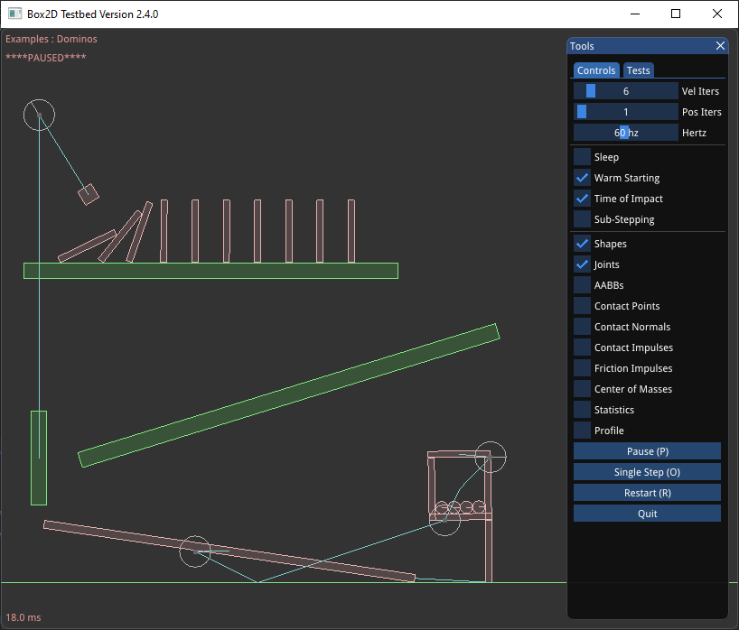

## 试验台

一旦您攻克了HelloWorld示例，您应该开始查看Box2D的测试床。测试平台是一个测试框架和演示环境。以下是一些功能：

- 具有平移和缩放功能的相机。
- 鼠标拾取附加到动态实体的形状。
- 可扩展的测试集
- 用于选择测试、参数调整和调试绘图选项的GUI。
- 暂停和单步模拟
- 文本呈现

这个测试台有许多Box2D在测试用例和框架中的使用示例。我鼓励您在学习Box2D时探索并修补测试台。

注意：测试台是用[ GLFW公司](https://www.glfw.org/)和[ 图像](https://github.com/ocornut/imgui). 测试台不是Box2D库的一部分。Box2D库对渲染是不可知的。如HelloWorld示例所示，不需要渲染器来使用Box2D。